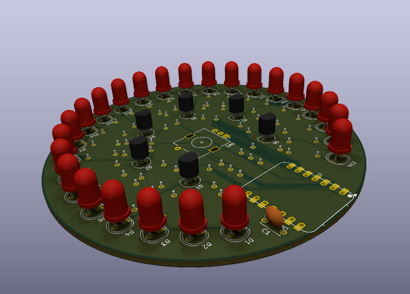
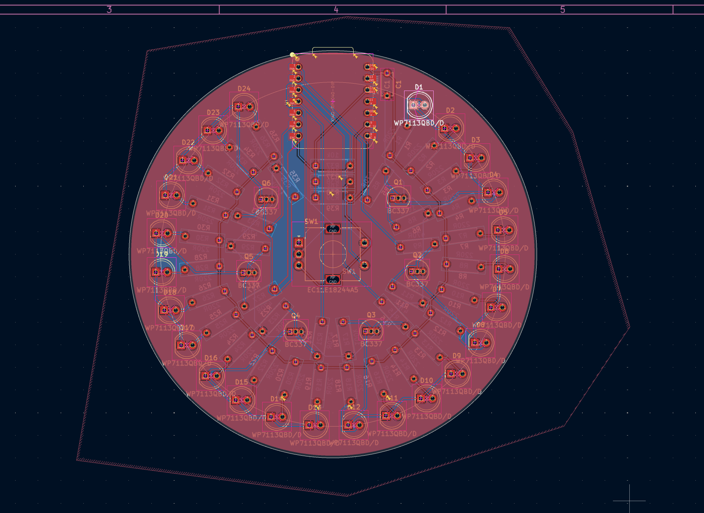
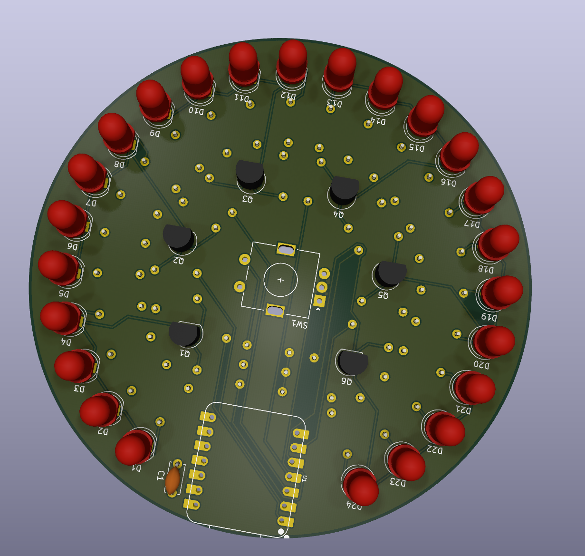
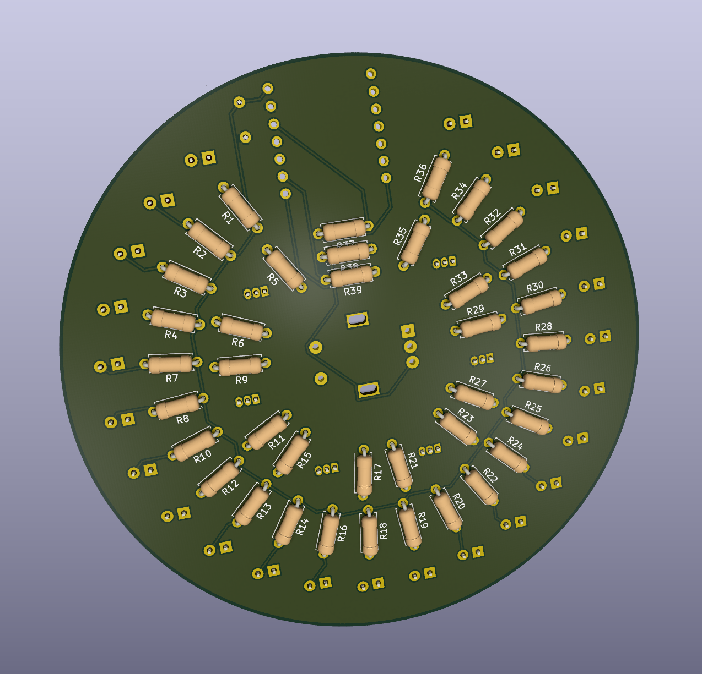
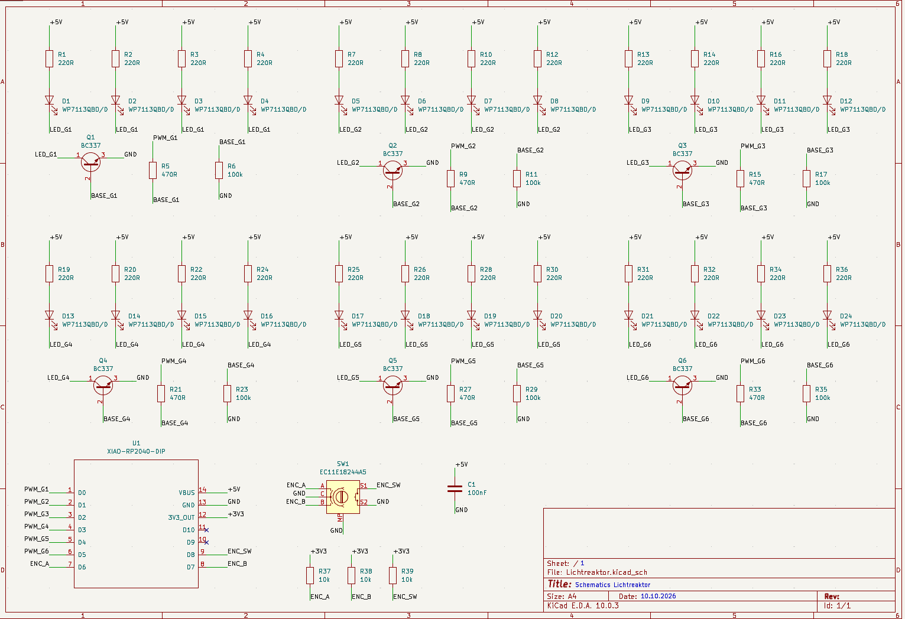

# Lichtreaktor

I'm designing a small, round arc-reactor lookalike that produces light in cool patterns. The plan is to press the rotary encoder to switch patterns, and turn it to control the brightness.

The PCB is 90 mm across, with 24 blue LEDs around the edge, a knob in the middle and a XIAO near the top for USB-C access. Six groups of four LEDs will be controlled independently. Tiny reactor, zero fusion involved.

The LEDs look red in KiCad's default 3D model, but the actual parts are blue. The XIAO and rotary encoder don't have 3D models loaded, so their positions look empty here.

## Where it's at

The schematic and PCB layout are done! All 24 LEDs are placed, the traces are routed, and both copper layers have a GND fill. The LEDs, transistors, encoder and XIAO sit on the front; the resistors sit on the back. Getting everything onto a round board took a few attempts, but it fits.

The latest KiCad check (10 October 2026) reports **0 errors, 0 unconnected items and 0 schematic/PCB mismatches**. There are still 24 silkscreen warnings: some printed outlines or labels overlap pads, each other or the board edge. Those are accepted for this layout; parts of the print may be clipped during manufacturing. The USB connector intentionally sticks out a little at the top.

This is still a design, not a tested reactor. The [firmware](firmware/README.md) is written, with five light patterns, encoder controls, adjustable speed, a group test and USB diagnostics. Final part and mechanical checks, supplier prices, fabrication files, soldering and testing on the actual board are next.

## How it works

USB supplies 5 V through the XIAO. Each LED has its own 220 Ω resistor, and each group of four shares a BC337 transistor that switches its connection to GND. The XIAO drives the six transistors through 470 Ω base resistors; 100 kΩ pull-downs keep them off when the control pins aren't being driven. PWM will let the firmware dim each group separately.

The encoder has two rotation signals and a push button, with three 10 kΩ pull-ups to 3.3 V. Turning it will change the brightness, and pressing it will change the pattern. The GND fills keep clearance from the other nets and use thermal reliefs so the pads are easier to hand-solder.

## What will I need to build this?

- Seeed Studio XIAO RP2040 (same one I used for my super cool and sick Hackpad)
- 24 blue LEDs (WP7113QBD/D) (ChatGPT's favourites)
- 24 LED resistors (220 Ω, 1/4 W), one per LED
- A PCB (self-designed ofc)
- 6 BC337 NPN transistors, one per group of four LEDs
- 6 transistor base resistors (470 Ω, 1/4 W)
- 6 transistor pull-down resistors (100 kΩ, 1/4 W)
- Alps Alpine EC11E18244A5 rotary encoder with push button
- 3 encoder pull-up resistors (10 kΩ, 1/4 W)
- 100 nF ceramic capacitor (at least 25 V)
- 2 seven-pin female headers (2.54 mm pitch) for the XIAO
- 2 matching male headers, if the XIAO doesn't already have them
- USB cable for power and programming through the XIAO's USB-C port

[Design BOM with KiCad symbols and footprints](bom.csv). Exact resistor, capacitor and header parts, supplier prices and final mechanical checks are still pending.

## Why these LED coordinates?

The numbers aren't random, even if typing them into KiCad feels a bit like it. The board has a 45 mm radius; the LED centres follow a smaller circle with a 38 mm radius. Its centre is at $(x_c,y_c)=(185,65)\,\mathrm{mm}$ in the PCB editor, right on the encoder shaft.

The planned ring starts 30 degrees clockwise from the top, with 13 degrees between neighbouring LEDs. For LED number $n$, from 1 to 24:

$$
\theta_n = 30^\circ + (n-1)\cdot 13^\circ
$$

The last LED lands at 329 degrees. That leaves a 61-degree gap across the top for the XIAO and USB connection. These angles are layout choices; the circle formula gives the coordinates from them.

KiCad's Y coordinate increases downwards. Measuring the angle clockwise from the top gives:

$$
x_{\mathrm{centre},n}=185\,\mathrm{mm}+38\,\mathrm{mm}\cdot\sin(\theta_n)
$$

$$
y_{\mathrm{centre},n}=65\,\mathrm{mm}-38\,\mathrm{mm}\cdot\cos(\theta_n)
$$

One small catch: the `LED_THT:LED_D5.0mm` footprint is anchored on pad 1, with the LED centre 1.27 mm to its right at 0-degree rotation. So the positions entered in KiCad are:

$$
x_{\mathrm{KiCad},n}=x_{\mathrm{centre},n}-1.27\,\mathrm{mm},\qquad
y_{\mathrm{KiCad},n}=y_{\mathrm{centre},n}
$$

For D1, $\theta_1=30^\circ$, which gives:

$$
x_{\mathrm{KiCad},1}=185+38\sin(30^\circ)-1.27=202.73\,\mathrm{mm}
$$

$$
y_{\mathrm{KiCad},1}=65-38\cos(30^\circ)\approx32.09\,\mathrm{mm}
$$

All LEDs use 0-degree rotation for this calculation, and coordinates are rounded to 0.01 mm. Neighbouring LED centres are about $2\cdot38\sin(13^\circ/2)=8.60\,\mathrm{mm}$ apart. Some resistor positions were adjusted by hand to avoid overlaps; the final layout passes KiCad's copper-clearance and courtyard checks.

## Design files

Open [the KiCad project](hardware/Lichtreaktor/Lichtreaktor.kicad_pro) to see the schematic and PCB. The project includes its XIAO symbol and footprint libraries; their source and adaptations are documented [here](hardware/Lichtreaktor/libraries/SOURCES.md).

## A closer look

### PCB layout

### Front and back

### Schematic

